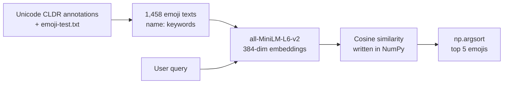

# Emoji Semantic Search 🔎😀

**Describe a feeling or a situation in plain English, and get back the 5 emojis that match it best.**

> 📚 **Course project.** This repository is part of my coursework for **Intro to LLMs**:
> Take-Home Assignment 1 (*Word Representation*), Question 1: *Creative Semantic Retrieval*.
> The goal of the assignment was to build a retrieval system on top of pretrained embeddings, keep the similarity,
> ranking and evaluation logic visible in the code, and critically analyse where embeddings succeed and fail.

[](https://colab.research.google.com/github/RushilJain96/emoji-semantic-search/blob/main/emoji_semantic_search.ipynb)

---

## Example

**Query:** `"nervous before a job interview"`

| Rank | Emoji | Name | Cosine similarity |
|:---:|:---:|---|:---:|
| 1 | 😰 | anxious face with sweat | 0.438 |
| 2 | 😟 | worried face | 0.372 |
| 3 | 😨 | fearful face | 0.357 |
| 4 | 😓 | downcast face with sweat | 0.332 |
| 5 | 😅 | grinning face with sweat | 0.328 |

The query never uses the words *anxious*, *worried* or *fearful*. The model matches them by **meaning**, not by exact words.

---

## How it works



1. **Dataset:** every emoji gets one text field built from official Unicode data, e.g.
   `face with tears of joy: crying, face, feels, funny, haha, happy, hilarious, joy, laugh, lol, ...`
2. **Embeddings:** a pretrained sentence-embedding model turns each text into a vector of 384 numbers (computed once).
3. **Similarity:** the query is embedded with the same model and compared with every emoji using cosine similarity,
   implemented by hand:
   ```python
   def cosine_similarity(query_vec, matrix):
       dots = matrix @ query_vec
       norms = np.linalg.norm(matrix, axis=1) * np.linalg.norm(query_vec)
       return dots / norms
   ```
4. **Ranking:** `np.argsort` picks the 5 highest scores.
5. **Evaluation:** 10 test queries, each result judged relevant or not by hand, scored with **Precision@5**.

No model is trained. The embedding model is used as-is.

---

## Dataset

Built from two official Unicode sources:

| Source | Used for |
|---|---|
| [Unicode CLDR English annotations](https://github.com/unicode-org/cldr-json/blob/main/cldr-json/cldr-annotations-full/annotations/en/annotations.json) | Each emoji's short name and keyword list |
| [Unicode `emoji-test.txt`](https://unicode.org/Public/emoji/latest/emoji-test.txt) (Emoji 18.0) | The official list of emojis (the CLDR file also contains plain symbols like `{`) |

To avoid near-duplicate results, the dataset leaves out **2,040 skin-tone variants**, **262 flags**, **73 emojis without CLDR keywords**
and **130 gendered versions** of emojis that already have a gender-neutral version (e.g. 🤦‍♂️ / 🤦‍♀️ when 🤦 exists).

**Result: 1,458 emojis**, saved as [`emojis.csv`](emojis.csv) with columns `emoji, name, keywords, text`.

---

## Results

Average **Precision@5 = 0.64** over 10 queries chosen to cover different kinds of language:

| Query type | Example query | Precision@5 |
|---|---|:---:|
| Clear emotion | "feeling sleepy and bored" | 0.80 |
| Situation | "celebrating a big win" | 0.73 |
| Mixed emotion | "proud but exhausted" | 0.80 |
| Slang / social meaning | "that's really cool" | 0.40 |
| Negation | "I'm not happy at all" | 0.60 |
| Abstract | "the calm before a storm" | 0.40 |

### What I found
- ✅ **Works well** when the query's words are close in meaning to the emoji keywords: synonyms (*nervous → anxious, worried, fearful*) and categories (*a win → trophy, medal, confetti*).
- ❌ **Slang is invisible to the model.** 💀 ("I'm dead", meaning *very funny*) ranked **980th of 1,458** for "that's hilarious", and 🔥 ranked **833rd** for "that's really cool". Their social meaning is not in the official descriptions.
- ❌ **Negation is ignored.** "I'm not happy at all" still returned 😀 *grinning face* at #3, because its keywords contain "happy".
- ⚠️ **Related topic, wrong meaning.** "so happy I could cry" also returned 😭 and 😢 (sad crying), and "stuck in traffic" returned 🚦 and 🛣️ (the topic, not the frustration).
- ⚠️ **The item text matters a lot.** Embedding only the emoji *name* instead of *name + keywords* showed keywords can help or hurt: 😂 rose from rank 227 → 7 for "that's hilarious", but 💀 fell from 350 → 980, and 🎀 *ribbon* jumped to #1 for "celebrating a big win" just because its keywords include "celebration".

The full analysis (query-by-query results, manual judgments and discussion of limitations) is in the notebook.

---

## Repository structure

```
emoji-semantic-search/
├── emoji_semantic_search.ipynb   # the notebook: data → embeddings → similarity → retrieval → evaluation → discussion
├── emojis.csv                    # the 1,458-emoji dataset
└── README.md
```

---

## Run it yourself

### Google Colab (easiest)
Click the **Open in Colab** badge above, then *Runtime → Run all*.
If `emojis.csv` is not uploaded alongside the notebook, it is rebuilt automatically from the Unicode sources
(the Unicode files can change over time, so a rebuild may give slightly different counts).

### Locally
```bash
python -m venv .venv
.venv\Scripts\activate            # on macOS/Linux: source .venv/bin/activate
pip install sentence-transformers pandas notebook
jupyter notebook emoji_semantic_search.ipynb
```
Then *Kernel → Restart & Run All*. It takes about a minute on a laptop CPU.

<details>
<summary><b>Windows troubleshooting</b></summary>

- **`OSError: [WinError 206] The filename or extension is too long`** during `pip install`: the Microsoft Store version of Python lives in a very long folder path, and PyTorch's files push it past Windows' 260-character limit. Create the virtual environment in a short path (e.g. `C:\venvs\emoji`) or enable Windows long-path support.
- **`CERTIFICATE_VERIFY_FAILED` when downloading the model**: antivirus software that scans HTTPS traffic re-signs it with its own certificate. Inside the virtual environment, run `pip install truststore` and add a `sitecustomize.py` to its `site-packages` folder containing:
  ```python
  import truststore
  truststore.inject_into_ssl()
  ```
</details>

---

## Built with
- [Sentence Transformers](https://www.sbert.net/) with the pretrained [`all-MiniLM-L6-v2`](https://huggingface.co/sentence-transformers/all-MiniLM-L6-v2) model
- NumPy (cosine similarity and ranking) and pandas (tables)
- Unicode CLDR and Emoji data, used under the [Unicode Terms of Use](https://www.unicode.org/terms_of_use.html)
